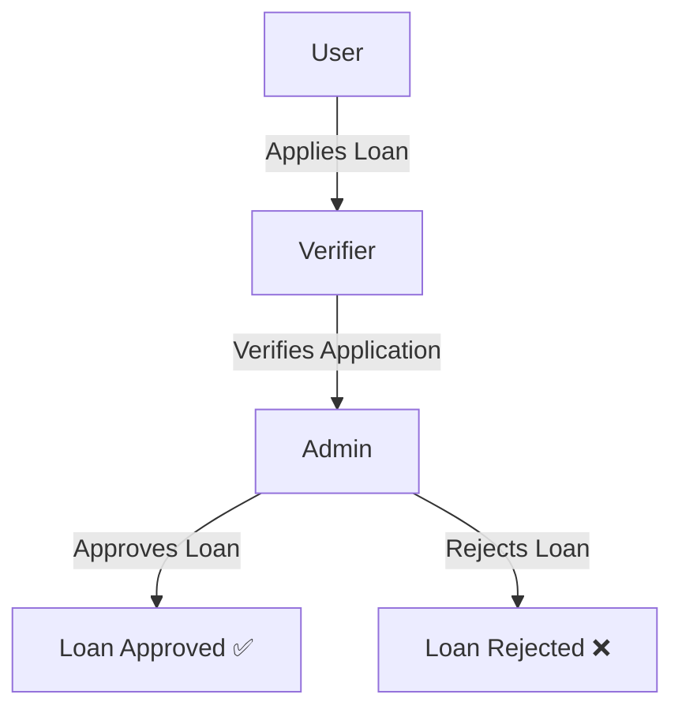

# 📌 Role-Based Loan Management System

A **Role-Based Loan Management System** that implements **Authentication, Authorization, and Workflow Management**.  
This project demonstrates how **Users**, **Verifiers**, and **Admins** interact in a secure, structured loan approval process.  

The application is designed to show how **role-based login systems** can be applied to real-world scenarios like **loan processing** in banks or financial institutions.  

---

## 📖 Table of Contents

- [Features](#-features)  
- [Roles & Responsibilities](#-roles--responsibilities)  
- [Tech Stack](#-tech-stack)  
- [System Workflow](#-system-workflow)  
- [Project Structure](#-project-structure)  
- [Installation & Setup](#-installation--setup)  
- [Environment Variables](#-environment-variables)  
- [API Endpoints](#-api-endpoints)  
- [Sample Usage Flow](#-sample-usage-flow)  
- [Screenshots](#-screenshots)  
- [Future Improvements](#-future-improvements)  
- [Contributing](#-contributing)  
- [License](#-license)  

---

## 🚀 Features

✔️ **Secure Authentication** – Register, login, JWT-based sessions  
✔️ **Role-Based Authorization** – Separate dashboards and permissions for each role  
✔️ **Loan Application System** – Users can apply for loans, save as drafts, and withdraw pending applications  
✔️ **Loan Verification** – Verifiers review & validate applications  
✔️ **Loan Approval** – Admins approve/reject loans after verification  
✔️ **Action-Oriented Dashboards** – Verifiers and Admins have "Requires My Action" widgets for their specific pending tasks  
✔️ **Automated Email Notifications** – Email alerts on loan status changes (Verification, Approval, Rejection)  
✔️ **Mandatory Rejection Reasons** – Reviewers must provide detailed reasons via a custom modal when denying loans  
✔️ **Financial Calculators** – Built-in EMI Calculator and Loan Eligibility Checker for users  
✔️ **Scalable & Modular** – Easy to add more roles or features  
✔️ **Responsive UI** – Works across devices  

---

## 🔑 Roles & Responsibilities

### 👤 **User**
- Register & Login  
- Apply for a loan (fill loan details, attach documents if needed)  
- Track loan application status  

### 🕵️ **Verifier**
- View **all pending loan applications**  
- Check applicant details (income, ID, documents, etc.)  
- Verify or Reject applications  

### 👨‍💼 **Admin**
- View **all verified applications**  
- Approve or Reject loans  
- Manage users and verifiers (optional)  

---

## 🛠 Tech Stack

**Frontend**
- React.js  
- Tailwind CSS / Bootstrap  
- Axios (API calls)  

**Backend**
- Node.js  
- Express.js  
- JWT (Authentication)  
- bcrypt.js (Password hashing)  

**Database**
- MongoDB / MySQL / PostgreSQL (depending on implementation)  

**Deployment**
- Vercel (Frontend)  
- AWS / Heroku / Render (Backend)  

---

## 🔄 System Workflow




# 📂 Project Structure

Role-Based-Login-System-Implementation/
│── backend/              # Express.js backend
│   │── models/           # Database models
│   │── routes/           # API routes
│   │── controllers/      # Business logic
│   │── middleware/       # Auth & role middlewares
│   │── server.js         # Entry point

│── frontend/             # React frontend
│   │── src/
│   │   │── components/   # UI Components
│   │   │── pages/        # Role-based pages
│   │   │── services/     # API calls
│   │   │── App.js
│   │   │── main.jsx

│── database/             # Schema / SQL scripts (if relational DB)
│── README.md             # Documentation

---

# ⚙️ Installation & Setup

### 🐳 Running with Docker Compose (Recommended)

If you have Docker installed, you can spin up the entire application (Database, Server, and Client) with a single command:

```bash
git clone https://github.com/NayanChouhan808/Role-Based-Login-System-Implementation.git
cd Role-Based-Login-System-Implementation
docker compose up -d
```

The frontend will be available at `http://localhost:5173` and the backend API at `http://localhost:3000`.

---

### Manual Setup (Without Docker)

### 1️⃣ Clone Repository

```bash
git clone https://github.com/NayanChouhan808/Role-Based-Login-System-Implementation.git
cd Role-Based-Login-System-Implementation
```

### 2️⃣ Database Setup

* Configure `.env` file in the `server` directory with your PostgreSQL connection string.
* Run prisma commands to setup the database:
```bash
npx prisma generate
npx prisma db push
```

### 3️⃣ Backend Setup

```bash
cd server
npm install
npm run dev
```

### 4️⃣ Frontend Setup

```bash
cd client
npm install
npm run dev
```

---

# 🔒 Environment Variables

Create `.env` inside **backend/**:

```env
PORT=5000
DB_URI=your_database_url
JWT_SECRET=your_secret_key
```

---

# 📡 API Endpoints

### 🔐 Authentication

* **POST** `/auth/register` → Register new user
* **POST** `/auth/login` → Login & get JWT

### 🏦 Loan Management

* **POST** `/loan/apply` → Apply for a loan (User only)
* **GET** `/loan/status/:id` → Check loan status (User only)

### ✅ Verification

* **GET** `/loan/pending` → Fetch pending loans (Verifier only)
* **POST** `/loan/verify/:id` → Verify loan (Verifier only)

### 🛂 Admin

* **GET** `/loan/verified` → Fetch verified loans (Admin only)
* **POST** `/loan/approve/:id` → Approve loan (Admin only)
* **POST** `/loan/reject/:id` → Reject loan (Admin only)

---

# 🧪 Sample Usage Flow

1. User registers & logs in → Receives a JWT token
2. User applies for loan → Loan marked as **Pending Verification**
3. Verifier logs in → Sees all pending loans → Verifies or rejects application
4. Admin logs in → Sees all verified applications → Approves or rejects loan

---

# 📸 Screenshots (Optional)

* Login Page
* User Dashboard
* Verifier Dashboard
* Admin Dashboard

*(Add screenshots here after running project 🚀)*

---

# 🔮 Future Improvements

* Implement SMS Notifications for immediate alerts
* Implement Loan Repayment Tracking
* Add Audit Logs for actions (who approved/rejected)
* Role Management UI for Admins
* Improve UI with more complex dashboards & reporting charts

---

# 🤝 Contributing

Contributions are welcome! 🎉

**Steps:**

1. Fork the repo
2. Create a new branch (`feature/new-feature`)
3. Commit changes
4. Push to your branch
5. Open a Pull Request

---

# 📜 License

This project is licensed under the **MIT License**.
